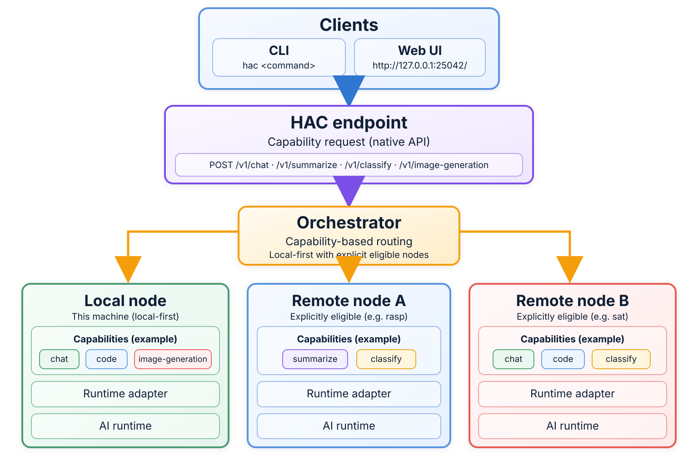
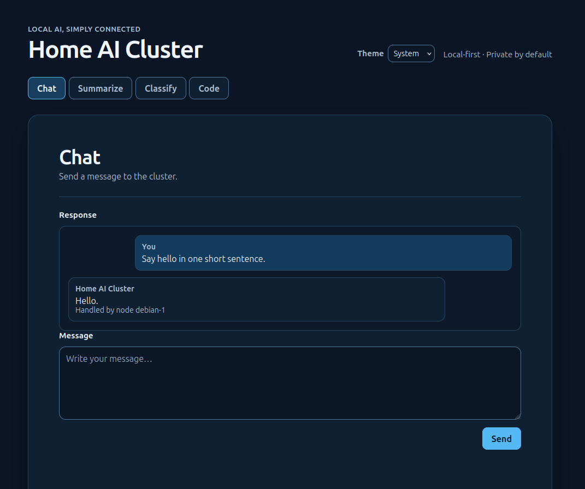

# Home AI Cluster

> Many machines. One AI.

Home AI Cluster is a local-first orchestration layer for personal AI runtimes.
It lets ordinary requests target capabilities instead of runtime brands or
machines, while keeping topology explicit and runtime ownership with the
operator.



[Get started](getting-started.md) · [View on GitHub](https://github.com/frian/home-ai-cluster)

## Local first

Home AI Cluster is designed around local machines and local runtimes. Ordinary
operation does not require a cloud control plane, automatic discovery, or a
hosted orchestration service.

## Private by default

Requests stay within the operator-owned local or explicitly declared topology
unless the operator deliberately uses a bounded external-information caller
edge.

## Runtime independent

The architecture is capability-centered rather than tied to one model or
inference engine. Runtime adapters remain replaceable, and ordinary users ask
for Chat, Summarize, Classify, or Code rather than selecting a runtime brand.

## Start small

The shortest useful path is one machine, one local runtime, and one Home AI
Cluster process:

```sh
uv tool install home-ai-cluster
hac local
```

Then open the fixed loopback browser at `http://127.0.0.1:25042/` on the same
machine, or send a request from another terminal:



```sh
hac chat "Hello"
```

See the [Getting Started guide](getting-started.md) for the complete first-use
path.

## Grow only when useful

A second machine is optional. When needed, Home AI Cluster can use an explicit
static local-plus-remote topology while preserving local-first,
capability-centered routing and operator-owned runtime lifecycle.

For exact behavior, use the [Command Reference](command-reference.md). For the
canonical operational sequence, use the [Operator Workflow](operator-workflow.md).
